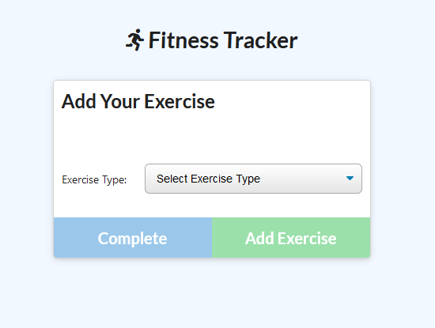

# #17 NoSQL-Fitness_Tracker

## [App Deloyed on Heroku](https://nosql-fitness-tracker-rr.herokuapp.com/)

## Description: A online app to keep track of your exercise routine: including distance, duration, weight, etc.

# Installation:

    Open heroku link and click "Get Started"

# Usage:

    Use "Add Exercise" to fill out workout details.

    Add Exercise to workout routine: Resistance or Cardio

  

    Click Dashboard to track workout routine.

# Questions: https://github.com/Crowderyan

### Email me: <a href="mailto:Rebuiltrival@gmail.com" hspace="20">Rebuiltrival@gmail.com</a>
